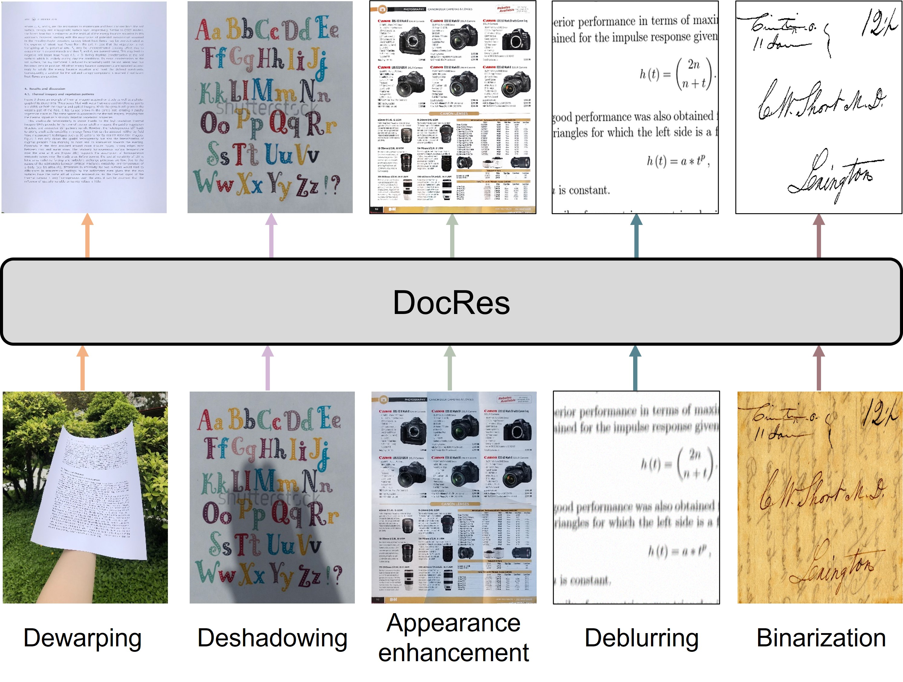

<div align=center>

# DocRes: A Generalist Model Toward Unifying Document Image Restoration Tasks

[](https://huggingface.co/spaces/qubvel-hf/documents-restoration)

</div>

<p align="center">

</p>

This is the official implementation of our paper [DocRes: A Generalist Model Toward Unifying Document Image Restoration Tasks](https://arxiv.org/abs/2405.04408).

## News 
🔥 [2025.2] Our new work [LGGPT](https://github.com/NiceRingNode/LGGPT) has been accepted to IJCV 2025! A lightweight LLM that unifies versatile layout generation tasks! Welcome to follow!
🔥 A comprehensive [Recommendation for Document Image Processing](https://github.com/ZZZHANG-jx/Recommendations-Document-Image-Processing) is available.


## Inference 
1. Put MBD model weights [mbd.pkl](https://1drv.ms/f/s!Ak15mSdV3Wy4iahoKckhDPVP5e2Czw?e=iClwdK) to `./data/MBD/checkpoint/`
2. Put DocRes model weights [docres.pkl](https://1drv.ms/f/s!Ak15mSdV3Wy4iahoKckhDPVP5e2Czw?e=iClwdK) to `./checkpoints/`
3. Run the following script and the results will be saved in `./restorted/`. We have provided some distorted examples in `./input/`.
```bash
python inference.py --im_path ./input/for_dewarping.png --task dewarping --save_dtsprompt 1
```

- `--im_path`: the path of input document image
- `--task`: task that need to be executed, it must be one of _dewarping_, _deshadowing_, _appearance_, _deblurring_, _binarization_, or _end2end_
- `--save_dtsprompt`: whether to save the DTSPrompt

## Evaluation

1. Dataset preparation, see [dataset instruction](./data/README.md)
2. Put MBD model weights [mbd.pkl](https://1drv.ms/f/s!Ak15mSdV3Wy4iahoKckhDPVP5e2Czw?e=iClwdK) to `data/MBD/checkpoint/`
3. Put DocRes model weights [docres.pkl](https://1drv.ms/f/s!Ak15mSdV3Wy4iahoKckhDPVP5e2Czw?e=iClwdK) to `./checkpoints/`
2. Run the following script
```bash
python eval.py --dataset realdae
```
- `--dataset`: dataset that need to be evaluated, it can be set as _dir300_, _kligler_, _jung_, _osr_, _docunet\_docaligner_, _realdae_, _tdd_, and _dibco18_.

## Training 
1. Dataset preparation, see [dataset instruction](./data/README.md)
2. Specify the datasets_setting within `train.py` based on your dataset path and experimental setting.
3. Run the following script
```bash
bash start_train.sh
```


## Citation:
```
@inproceedings{zhangdocres2024, 
Author = {Jiaxin Zhang, Dezhi Peng, Chongyu Liu , Peirong Zhang and Lianwen Jin}, 
Booktitle = {In Proceedings of the IEEE/CV Conference on Computer Vision and Pattern Recognition}, 
Title = {DocRes: A Generalist Model Toward Unifying Document Image Restoration Tasks}, 
Year = {2024}}   
```
## ⭐ Star Rising
[](https://star-history.com/#ZZZHANG-jx/DocRes&Timeline)
