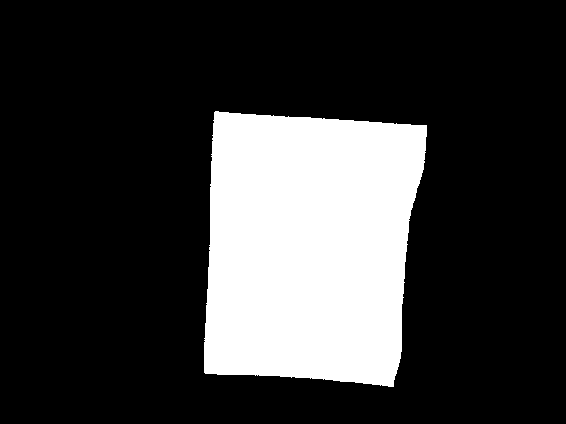
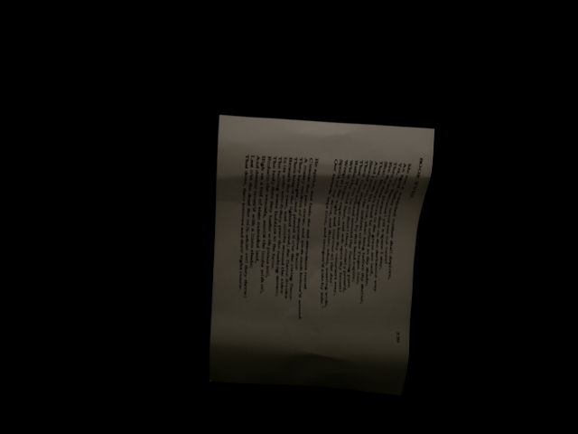
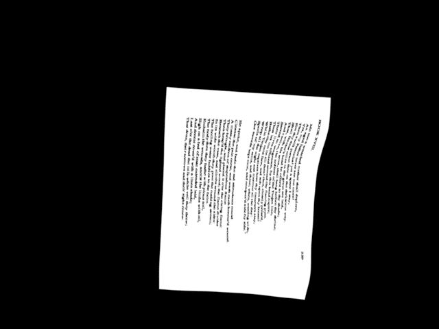
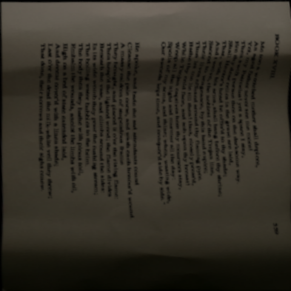
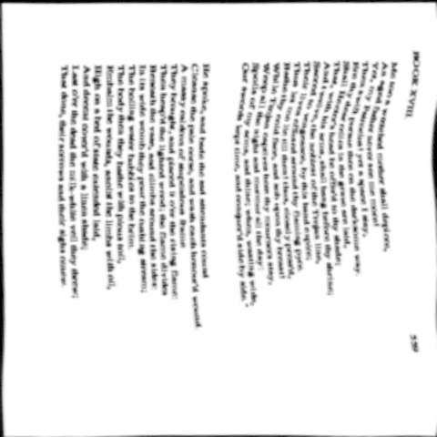
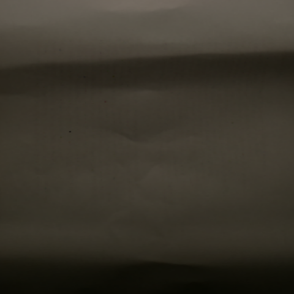

# Dataset Preparation
The data files tree should be look like:
```
data/
    eval/
        dir300/
            1_in.png
            1_gt.png
            ...
        kligler/
        jung/
        osr/
        realdae/
        docunet_docaligner/
        dibco18/
    train/
        dewarping/
            doc3d/
        deshadowing/
            fsdsrd/
            tdd/
        appearance/
            clean_pdfs/
            realdae/
        deblurring/
            tdd/
        binarization/
            bickly/
            dibco/
            noise_office/
            phibd/
            msi/
```

## Evaluation Dataset
You can find the links for downloading the dataset we used for evaluation (Tables 1 and 2) in [this](https://github.com/ZZZHANG-jx/Recommendations-Document-Image-Processing/tree/master) repository, including DIR300 (300 samples), Kligler (300 samples), Jung (87 samples), OSR (237 samples), RealDAE (150 samples), DocUNet_DocAligner (150 samples), TDD (16000 samples) and DIBCO18 (10 samples). After downloading, add the suffix of `_in` and `_gt` to the input image and gt image respectively, and place them in the folder of the corresponding dataset


## Training Dataset
You can find the links for downloading the dataset we used for training in [this](https://github.com/ZZZHANG-jx/Recommendations-Document-Image-Processing/tree/master) repository.
### Dewarping
- Doc3D
    - Mask extraction: you should extract the mask for each image from the uv data in Doc3D
    - Background preparation: you can download the background data from [here](https://www.robots.ox.ac.uk/~vgg/data/dtd/) and specify it for self.background_paths in `loaders/docres_loader.py`
- JSON preparation: 
```

[
    ## you need to specify the paths of 'in_path', 'mask_path and 'gt_path':
    {
        "in_path": "dewarping/doc3d/img/1/102_1-pp_Page_048-xov0001.png",
        "mask_path": "dewarping/doc3d/mask/1/102_1-pp_Page_048-xov0001.png",
        "gt_path": "dewarping/doc3d/bm/1/102_1-pp_Page_048-xov0001.npy"
    }
]

```
### Deshadowing
- RDD
- FSDSRD
- JSON preparation
```
[   ## you need to specify the paths of 'in_path' and 'gt_path', for example:
    {
        "in_path": "deshadowing/fsdsrd/im/00004.png",
        "gt_path": "deshadowing/fsdsrd/gt/00004.png"
    },
    {
        "in_path": "deshadowing/rdd/im/00004.png",
        "gt_path": "deshadowing/rdd/gt/00004.png"
    }
]
```
### Appearance enhancement
- Doc3DShade
    - Clean PDFs collection: You should collection PDFs files from the internet and convert them as images to serve as the source for synthesis.
    - Shadow extraction:
        - Run `python data/preprocess/shadow_extraction.py` to extract shadows. 
        - The principle of  `data/preprocess/shadow_extraction.py`:
            - step1: utilize the the mask (as shown in img1) to dewarp the original images (as shown in img2) and alb_images (as shown in img3), resulting in the dewarped images img4 and img5
            - step2: extract the shadow images (as shown in img6) based on img4 and img5.
    - Point self.shadow_paths in `loaders/docres_loader.py` to the folder containing the shadow images.

|img1|img2|img3|
|----|----|----|
||||
|img4|img5|img6|
||||

- RealDAE
- JSON preparation: 
```
[
    ## for Doc3DShade dataset, you only need to specify the path of image from PDF, for example:
    {   
        'gt_path':'appearance/clean_pdfs/1.jpg'
    },

    ## for RealDAE dataset, you need to specify the paths of both input and gt, for example:
    {
        'in_path': 'appearance/realdae/1_in.jpg',
        'gt_path': 'appearance/realdae/1_gt.jpg'
    }
]

```

### Debluring
- TDD
- JSON preparation
```
[   ## you need to specify the paths of 'in_path' and 'gt_path', for example:
    {
        "in_path": "debluring/tdd/im/00004.png",
        "gt_path": "debluring/tdd/gt/00004.png"
    },
]
```
### Binarization
- Bickly
    - DTPrompt preparation: Since the DTPrompt for binarization is time-expensive, we obtain it offline before training. Use `data/preprocess/sauvola_binarize.py`
- DIBCO
    - DTPrompt preparation: the same as Bickly
- Noise Office
    - DTPrompt preparation: the same as Bickly
- PHIDB
    - DTPrompt preparation: the same as Bickly
- MSI
    - DTPrompt preparation: the same as Bickly
- JSON preparation
```
[   
    ## you need to specify the paths of 'in_path', 'gt_path', 'bin_path', 'thr_path' and 'gradient_path', for example:
    {
        "in_path": "binarization/noise_office/imgs/1.png",
        "gt_path": "binarization/noise_office/gt_imgs/1.png",
        "bin_path": "binarization/noise_office/imgs/1_bin.png",
        "thr_path": "binarization/noise_office/imgs/1_thr.png",
        "gradient_path": "binarization/noise_office/imgs/1_gradient.png"
    },
]
```

After all the data are prepared, you should specify the dataset_setting in `train.py`.


